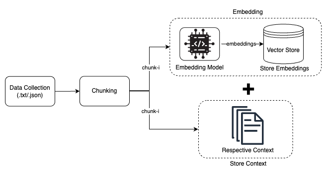
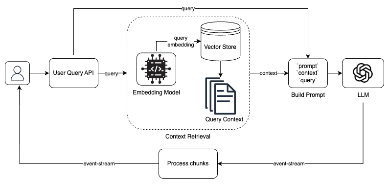

# Veritas AI

**Veritas AI** is a modular Retrieval-Augmented Generation (RAG) based personal assistant system designed to answer questions using relevant contextual information. This repository uses a monorepo architecture that includes both the UI frontend and backend server components.

## Overview

The core idea of **Veritas AI** is to enrich user queries with relevant context chunks from ingested raw data, enabling a Large Language Model (LLM) to generate more accurate and relevant responses.

The system is organized into two main components:

- [`veritas-chat`](./veritas-chat): Frontend UI for interacting with the RAG system.
- [`veritas-server`](./veritas-server): Backend server for data ingestion, context retrieval, prompt construction, and LLM interaction.

## Architecture

The RAG pipeline is split into two primary workflows:

### 1. Context Workflow

This stage processes raw data and prepares it for query-time retrieval.



- **Data Collection**: Supports `.txt` and `.json` file formats. Please refer to the README in `veritas-server` to prepare and run the RAG context.
- **Chunking**: Breaks documents into manageable chunks.
- **Embedding**: Each chunk is transformed into a vector using an embedding model and stored in a vector database.
- **Context Storage**: The raw text of the chunk is stored alongside the embeddings.

### 2. Query Handling and Context Retrieval

This stage retrieves relevant chunks and uses them to generate LLM prompts.



- **User Query**: Received via the API.
- **Query Embedding**: The user’s question is embedded and compared against the stored vectors.
- **Context Retrieval**: Top-k (=5) similar chunks are fetched using cosine similarity (preferred for semantic inclusion).
- **Prompt Construction**: The retrieved context is combined with the query.
- **LLM Generation**: The constructed prompt is passed to the LLM, and the response is streamed back to the user.

---

## Getting Started

To run the full system, please refer to the respective README files inside [`veritas-chat`](./veritas-chat) and [`veritas-server`](./veritas-server) for setup and usage instructions specific to each component.

### Local Development

1. **Start the backend server**:
   See [`veritas-server`](./veritas-server) for details.

2. **Run the frontend application**:
   See [`veritas-chat`](./veritas-chat) for setup and launch instructions.

### Docker Setup

You can also run the entire stack using Docker Compose.

Make sure Docker and Docker Compose are installed on your system.

From the root of the repository:

```bash
docker-compose up --build
```

This will start the following services:

- **veritas-server** on port `8080`
- **veritas-chat** on port `3000` (depends on the backend)

To stop the services:

```bash
docker-compose down
```
